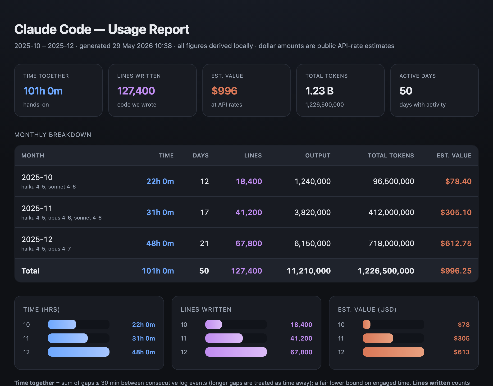

# claude-code-usage

A tiny, local report that turns your [Claude Code](https://claude.com/claude-code) history into a clean HTML dashboard — **time spent, lines of code written, tokens, and estimated API-rate value** — over a rolling window of months.

Everything is computed on your machine from `~/.claude/projects`. **No data leaves your computer**, no account, no API key, no telemetry.

> On a **Pro/Max** subscription the dollar figure is the *equivalent* value at public API list prices — not money you were billed. It's a fun way to see how much leverage your subscription gives you.



*(Prefer to look first? Open [`examples/sample-report.html`](examples/sample-report.html) in your browser — it's built from synthetic data.)*

---

## What it measures

| Metric | How it's derived | Caveat |
|---|---|---|
| **Time together** | Sum of gaps between consecutive log events, counting only gaps ≤ idle cutoff (default 30 min). | A fair *lower bound* on engaged time — there's no "user is reading" event, so anything past the cutoff is treated as time away. |
| **Lines written** | Lines of content emitted via `Write` / `Edit` / `MultiEdit` / `NotebookEdit` tool calls. | A proxy for output volume, **not** a net git diff. Rewrites and overwrites all count. |
| **Tokens & est. value** | From [`ccusage`](https://github.com/ryoppippi/ccusage), which prices your local token counts at public API rates. | Requires Node.js (`npx`). Without it, those columns are blank and the rest still works. |
| **Active days** | Distinct calendar days with any activity. | UTC-based (matches the log timestamps). |

---

## Quick start

No install required — it's a single dependency-free Python file (3.8+).

```bash
git clone https://github.com/alessandr0b/claude-code-usage.git
cd claude-code-usage

# Preview with synthetic data (no logs needed):
python3 claude_usage_report.py --demo --open

# Generate your real report (rolling last 3 months) and open it:
python3 claude_usage_report.py --open
```

The report is written to `~/claude-code-usage-reports/usage-<month>.html`.

**Requirements**
- Python 3.8+ (standard library only)
- [Claude Code](https://claude.com/claude-code) with logs in `~/.claude/projects`
- *Optional:* Node.js, for the token & cost columns (via `npx ccusage`)

---

## Options

```
python3 claude_usage_report.py [options]

  --months N           Months of history to include (default: 3)
  --out-dir DIR        Output directory (default: ~/claude-code-usage-reports)
  --projects-dir DIR   Claude Code logs dir (default: ~/.claude/projects)
  --idle-cutoff MIN    Gap (minutes) above which time stops counting (default: 30)
  --open               Open the report in your browser when done
  --demo               Use built-in synthetic data — no logs required
```

Examples:

```bash
python3 claude_usage_report.py --months 6                 # half-year view
python3 claude_usage_report.py --idle-cutoff 15           # stricter "engaged" time
python3 claude_usage_report.py --out-dir ~/Desktop --open
```

---

## Run it automatically every month

The installer schedules a monthly regeneration — **launchd** on macOS, **cron** on Linux.

```bash
./install.sh
```

This runs the report on the **1st of each month at 09:00**, writing to `~/claude-code-usage-reports/`. You can pass a custom output directory:

```bash
./install.sh ~/Documents/usage-reports
```

To remove the schedule later:

```bash
./uninstall.sh
```

<details>
<summary>What the installer actually does</summary>

- **macOS** — renders `templates/com.claude-code-usage.monthly.plist` with your Python path, the script path, your output dir, and a `PATH` that includes your Node install (so `npx ccusage` works under launchd), then loads it into `~/Library/LaunchAgents/`.
- **Linux** — adds a single `crontab` line: `0 9 1 * * <python> <script> --out-dir <dir>`.

Both are idempotent — re-running replaces the existing job.
</details>

---

## How it works

```
~/.claude/projects/**/*.jsonl   ──▶  parse_logs()      ──▶  time, lines, active days
npx ccusage monthly --json      ──▶  ccusage_monthly() ──▶  tokens, cost, models
                                          │
                                          ▼
                                  build_html()  ──▶  self-contained usage-<month>.html
```

The output is a single static HTML file with inline CSS — no JavaScript, no external requests. Open it anywhere, email it, or commit it.

---

## Privacy

This tool is **100% local**. It reads your existing Claude Code logs, runs `ccusage` locally, and writes an HTML file to disk. Nothing is uploaded anywhere. The committed sample (`examples/sample-report.html`) uses synthetic numbers, not anyone's real usage.

---

## Contributing

Issues and PRs welcome — see [CONTRIBUTING.md](CONTRIBUTING.md). Ideas: per-project breakdowns, weekly/daily granularity, CSV/JSON export, light theme, a small "streak" stat.

## Acknowledgements

Token and cost data comes from the excellent [`ccusage`](https://github.com/ryoppippi/ccusage) by [@ryoppippi](https://github.com/ryoppippi).

## License

[MIT](LICENSE)
